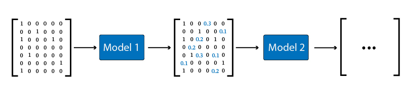

# Recommender Systems Challenge - AY 2023/2024

Welcome to the repository for the 2023 Recommender Systems course challenge. This repository is designed to serve two primary purposes:

1. **Challenge Notebooks**: It contains all the Jupyter notebooks (models) used for the recommender systems challenge. These notebooks are designed to guide you through the challenge, providing a structured approach to building and evaluating recommender systems.
2. **Updated Course Materials**: The entire course repository has been updated from *Python 3.7* to ensure compatibility with **Python 3.10**. This update includes modifications to the code and some libraries' versions, ensuring that you can smoothly run and explore the course materials using environments like _Colab_ and _Kaggle_.

The goal of this repository is thus to provide a comprehensive resource to help quickstart your participation in a future course challenge.

## Challenge: Book Recommendations

This year's challenge focused on providing recommendation for books. We were provided just with an **implicit** URM and **no ICM**, meaning the recommendations will be based off of (mainly) *Collaborative Filtering* techniques.

The evaluation criterion used was Mean Average Precision @ 10.

The dataset provided consisted of 478000+ implicit interactions between users and items, as such:

<p align="center">
	
</p>

where each interaction meant a user rated such book with at least **4 stars**.

The main issue with this setup is the anonimity of the dataset, and lack of interpretability of results, making it impossible to run any relevant analysis on data.

However, our team focused from the beginning on **Collaborative Filtering** and **Matrix Factorization** techniques, with the latter being an attempt to extract as much information as possible from the data we had. Matrix Factorization did not prove to be useful in this context, while collaborative filtering techniques showed promising results immediately, with a model as simple as ItemKNN obtaining a MAP@10 of around 0.09. 

To boost our model's performance, we resorted to **hybrid** models. Specifically, hybrids composed of models that worked on similarity matrices proved to be the best approach, such as:

 - ItemKNN + RP3Beta
 - ItemKNN + RP3Beta + SLIM_EN (ElasticNet)

### Hyperparameter Tuning

Like in previous years, this challenge put heavy focus on finding the best hyperparameters possible for our models. For this reason our team focused on this step, optimizing each model and the resulting hybrids to achieve the best MAP@10 score possible.

The tuning of parameters was run with the library `Optuna`.

### Original Techniques

Our group did not stop at fine-tuning the models to find the best parameters possible, but explored many different routes to boost our model's performance.
Most notably, we attempted working on **Pipelined Hybrids** and **Automating XGBoost tuning**.

#### Pipelined Hybrids

<p align="center">
	
</p>

This approach consisted in creating an **enriched** URM with a pipelined approach: This meant "connecting" more models one after the other, using one's output as the next one's input.

This type of models can come with a set of issues, among which:
 1. Enriched URM too dense
 2. Too much confidence in the enriched recommendations
 3. Unbalanced increment in the amount of interactions of a user

Our implementation handles these problems via two functions:
 - `sparsify_matrix`: Given a percentile, calculate the threshold on the new URM, and set all values below-threshold to zero. The remaining values are re-scaled by a `confidence` factor.
 - `fix_increase_enriched_urm`: Given a maximum interaction increment, this function limits the *enriched* interactions in a way that is proportional to the original amount of interactions.

 Unfortunately, given the strict deadlines of the challenge we were unable to experiment more with this approach.

 For an in-depth look, please refer to the corresponding **[notebook](notebooks/hybrid-pipelining-tuning.ipynb)**.

 #### Automating XGBoost Tuning

XGBoost is a powerful tool to enhance the performance of a model, but tuning the numerous hyperparameters can be extremely time-consuming.

For this reason, we decided to work on a way to integrate XGBoost with the course repository, to make use of the same optimization pipelines that we typically use with the recommenders alredy implemented in the repository.

This custom pipeline takes care of:
 1. Run versioning: To save and reload models due to time constraints on online platforms like Kaggle/Colab.
 2. Integrating XGBoost in the course repository as a new custom Recommender
 3. Implementing a hyperparameter tuning pipeline for XGBRanker

 Again, given the strict deadlines, we were unable to experiment more with this.

 For an in-depth look, please refer to the corresponding **[notebook](notebooks/custom-xgboost-pipeline-tuning.ipynb)**.

 #### Results
 Our team placed in the top 30% at the end of the final deadline, among 60+ teams.

 ## Updated Course Materials

 This repository contains all of the course material updated to work with newer versions of Python, tested up to **3.10**, in the **[course_repository](course_repository/)** folder.

 This has been tested on both **Linux** and **MacOS ARM**, and could have some issues on Windows. Nevertheless, this works smoothly with notebooks on Kaggle/Colab, without needing to upgrade/downgrade Python version.

 For reference, we used the following versions for the libraries required:
 ```
 Cython 3.0.0,
 h5py 3.9.0,
 nltk 3.2.4,
 nose 1.3.7,
 numpy 1.24.3
 scikit-learn 1.2.2
 scikit-optimize 0.9.0
 scipy 1.11.3
 tqdm 4.66.1
 lightfm 1.17
 RISE 5.7.1
 torch 2.0.0+cpu
 jupyter-contrib-nbextensions 0.7.0
 tensorflow 2.13.0
 tables 3.9.1
 ```

 With the main hurdle being upgrading Cython and numpy.

 Note that the upgraded material was _not_ thoroughly tested, so there may be some issues. However, the `run_compile_all.py` script is able to complete successfully, which enables all the optimizations introduced with the Cython scripts, drastically reducing the computational cost of most models.

 ## Authors

 [Federico Toschi](https://github.com/ftoschi14) - Challenge Notebooks, Updating Course Material
<p>

 [Tomaso Stefanizzi](https://github.com/tomasostefanizzi) - Challenge Notebooks
