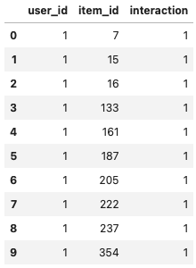

# Recommender Systems Challenge - AY 2023/2024

Welcome to the repository for the 2023 Recommender Systems course challenge. This repository is designed to serve two primary purposes:

1. **Challenge Notebooks**: It contains all the Jupyter notebooks (models) used for the recommender systems challenge. These notebooks are designed to guide you through the challenge, providing a structured approach to building and evaluating recommender systems.
2. **Updated Course Materials**: The entire course repository has been updated to ensure compatibility with **Python 3.10+**. This update includes modifications to the code and some libraries' versions, ensuring that you can smoothly run and explore the course materials using the latest Python version. (As of December 2023)

The goal of this repository is thus to provide a comprehensive resource to help quickstart your participation in a future course challenge.

# Challenge: Book Recommendations

This year's challenge focused on providing recommendation for books. We were provided just with an **implicit** URM and **no ICM**, meaning the recommendations will be based off of (mainly) *Collaborative Filtering* techniques.

The evaluation criterion used was Mean Average Precision @ 10.

The dataset provided consisted of 478000+ implicit interactions between users and items, as such:

	

where each interaction meant a user rated such book with at least **4 stars**.

The main issue with this setup is the anonimity of the dataset, and lack of interpretability of results, making it impossible to run any relevant analysis on data.

However, our team focused from the beginning on **Collaborative Filtering** and **Matrix Factorization** techniques, with the latter being an attempt to extract as much information as possible from the data we had. Matrix Factorization did not prove to be useful in this context, while collaborative filtering techniques showed promising results immediately, with a model as simple as ItemKNN obtaining a MAP@10 of around 0.09. 

To boost our model's performance, we resorted to **hybrid** models. Specifically, hybrids composed of models that worked on similarity matrices proved to be the best approach, such as:

 - ItemKNN + RP3Beta
 - ItemKNN + RP3Beta + SLIM_EN (ElasticNet)

### Hyperparameter Tuning

Like in previous years, this challenge put heavy focus on finding the best hyperparameters possible for our models. For this reason our team focused on this step, optimizing each model and the resulting hybrids to achieve the best MAP@10 score possible.

The tuning of parameters was run with the library `Optuna`.

## Original Techniques

Our group did not stop at fine-tuning the models to find the best parameters possible, but explored many different routes to boost our model's performance.
Most notably, we attempted working with **Pipelined Hybrids** and **Automating XGBoost tuning**.

### Pipelined Hybrids

###
